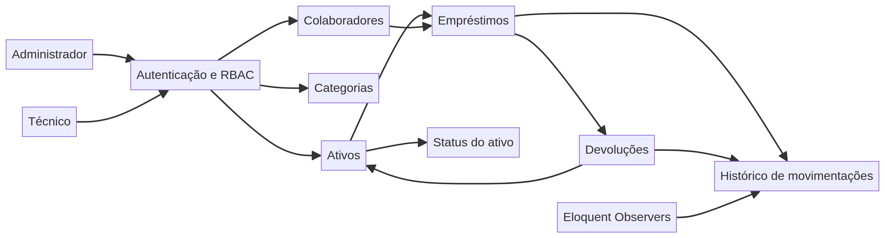
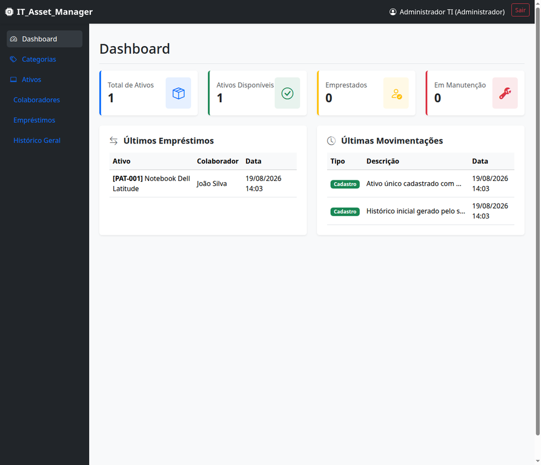

# IT Asset Manager

O IT Asset Manager é uma aplicação Laravel para controlar ativos de TI, empréstimos, devoluções e histórico de movimentações. O sistema substitui fluxos fragmentados baseados em planilhas por uma aplicação com rastreabilidade, controle de acesso por papéis e regras de negócio explícitas.

## Prévia do domínio



O diagrama resume o fluxo central: usuários autenticados operam sobre ativos, funcionários e empréstimos; as devoluções atualizam a disponibilidade e o histórico de movimentações registra as alterações para fins de auditoria.

## Prévia do dashboard



A prévia local usa dados de demonstração gerados pelos seeders e mostra o resumo do inventário, empréstimos recentes e histórico de movimentações. Ela serve apenas para inspeção do portfólio; credenciais e dados pertencem a um ambiente local de desenvolvimento.

## Problema resolvido

A aplicação centraliza o ciclo de vida de notebooks, monitores e outros ativos de TI. Ela registra o responsável por cada ativo, quando ele foi emprestado, quando foi devolvido e quais ações alteraram seu estado.

## Principais capacidades

- Gerenciamento de ativos, categorias e funcionários.
- Fluxos de empréstimo e devolução com alteração automática de status.
- Controle de acesso por papéis para administradores e técnicos.
- Autenticação e rotas protegidas.
- Histórico de movimentações e registros de auditoria por meio de Eloquent Observers.
- Dados locais gerados por seeders para uma demonstração reproduzível.
- Organização MVC seguindo as convenções do Laravel.

## Regras de negócio

| Regra | Comportamento esperado |
|---|---|
| Pertencimento do ativo | Todo ativo pertence a uma categoria. |
| Empréstimo ativo | Um ativo não pode ter mais de um empréstimo ativo. |
| Novo empréstimo | O status do ativo muda para **Em uso**. |
| Devolução | A data de devolução é registrada e o ativo volta para **Disponível**. |
| Auditoria | As movimentações do ativo são registradas no histórico. |
| Papel técnico | Técnicos podem consultar registros e operar empréstimos e devoluções. |
| Papel administrador | Administradores têm acesso completo a CRUD e gerenciamento de usuários. |

## Stack tecnológica

| Área | Tecnologias |
|---|---|
| Backend | PHP 8.3 ou superior, Laravel 13 |
| Banco padrão | SQLite configurado no `.env.example` |
| Banco alternativo | MySQL ou outro banco compatível configurado no `.env` |
| Views e interface | Blade, Bootstrap 5, Font Awesome |
| ORM e arquitetura | Eloquent ORM, MVC, Eloquent Observers |
| Ferramentas | Composer, Vite, Laravel Boost, PHPUnit |

## Execução local

### Requisitos

- PHP 8.3 ou superior.
- Composer.
- Node.js e npm.
- SQLite, que é o banco padrão do ambiente de exemplo, ou MySQL/outro banco configurado manualmente.

### Instalação rápida

```bash
git clone https://github.com/osacra/IT_Asset_Manager.git
cd IT_Asset_Manager
composer install
cp .env.example .env
php artisan key:generate
php artisan migrate --seed
npm install
npm run build
php artisan serve
```

Abra `http://127.0.0.1:8000` no navegador. Os seeders criam usuários locais de demonstração. As credenciais não são reproduzidas neste README; inspecione ou personalize os seeders em um ambiente local antes de compartilhar uma instância de demonstração. Nunca reutilize senhas de desenvolvimento em produção.

### Usando MySQL

O `.env.example` usa SQLite por padrão. Para usar MySQL, altere as variáveis de banco no `.env`:

```dotenv
DB_CONNECTION=mysql
DB_HOST=127.0.0.1
DB_PORT=3306
DB_DATABASE=it_asset_manager
DB_USERNAME=root
DB_PASSWORD=sua_senha
```

Crie o banco previamente, confirme a conexão e execute:

```bash
php artisan migrate --seed
```

### Scripts oficiais

O `composer.json` oferece atalhos para os fluxos mais comuns:

| Comando | Finalidade |
|---|---|
| `composer run setup` | Instala dependências, prepara o ambiente, executa migrations e gera a build frontend |
| `composer run dev` | Inicia servidor Laravel, fila, logs e Vite em paralelo |
| `composer run test` | Limpa a configuração e executa os testes PHPUnit |
| `npm run dev` | Inicia o Vite para desenvolvimento frontend |
| `npm run build` | Gera os assets frontend de produção |

Para desenvolvimento contínuo, depois da instalação e configuração do banco, prefira:

```bash
composer run dev
```

## Estrutura do projeto

```text
app/                   Models, controllers e lógica de domínio
database/              Migrations e seeders locais
resources/             Views Blade e assets frontend
routes/                Rotas web e de autenticação
tests/                 Testes automatizados
README.md              Documentação de instalação e arquitetura
PLANO_IMPLEMENTACAO.md Plano de implementação
RELATORIO.md           Relatório de desenvolvimento
```

## Notas de engenharia

O sistema mantém o comportamento de domínio próximo aos modelos Laravel e às fronteiras de serviço. Eloquent Observers fornecem o histórico de auditoria das movimentações, enquanto as regras de autorização separam as capacidades administrativas dos fluxos de técnicos. O projeto também documenta o plano de implementação e as decisões relacionadas ao escopo do MVP.

## Roadmap

- Ampliar a cobertura de testes de funcionalidades e autorização.
- Adicionar relatórios de auditoria pesquisáveis e exportáveis.
- Melhorar validações e mensagens para casos de borda.
- Adicionar CI para testes PHP e validação da build frontend.
- Publicar um ambiente de demonstração controlado com credenciais isoladas.
